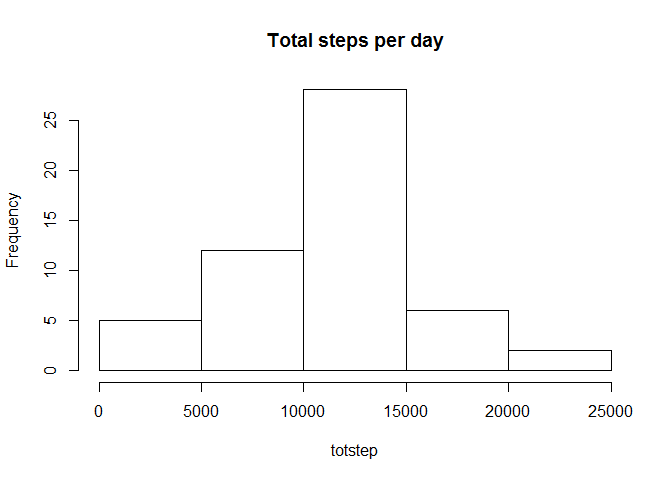
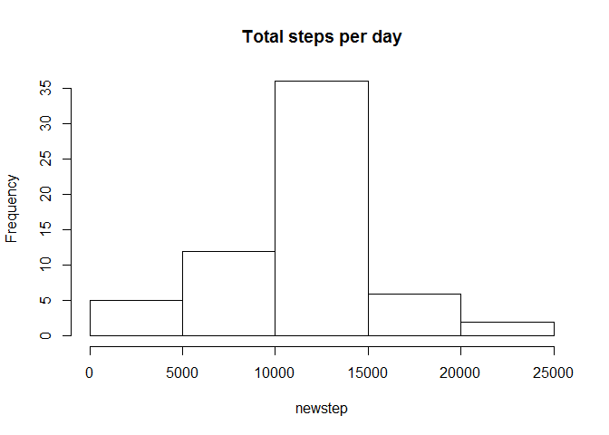

# Reproducible Research: Peer Assessment 1

## Loading and preprocessing the data

```r
dataset <- read.csv('C:/Users/Angela/Desktop/Coursera/data_activity/activity.csv', na.strings = "NA", stringsAsFactors = FALSE, colClasses=c('numeric', 'Date','numeric'))
```


## What is mean total number of steps taken per day?

```r
data <- na.omit(dataset)
totstep <- by(data$steps,data$date,sum)
plot <- hist(totstep, main="Total steps per day")
```

 

```r
print(mean <- mean(totstep,na.rm="TRUE"))
```

```
## [1] 10766.19
```

```r
print(median <- median(totstep,na.rm="TRUE"))
```

```
## [1] 10765
```


## What is the average daily activity pattern?

```r
avg <- aggregate(data$steps~data$interval, data, FUN="mean")
plot(avg, type = "l", xlab = "interval", ylab = "steps")
```

 

```r
names(avg)[1] <- "intervals"
names(avg)[2] <- "step"
print(avg$intervals[which.max(avg$step)])
```

```
## [1] 835
```


## Imputing missing values

```r
count <- nrow(subset(dataset, is.na(dataset$steps)))
totstep1 <- tapply(data$steps,data$interval,FUN=mean)
dataset[is.na(dataset$steps),1] <- totstep1
#print(dataset)
# ind <- which(is.na(dataset$steps), arr.ind=TRUE)
# df[ind] <- rowMeans(dataset$steps,  na.rm = TRUE)[ind[,1]]
newstep <- by(dataset$steps,dataset$date,sum)
plot <- hist(newstep, main="Total steps per day")
```

 

```r
print(mean <- mean(newstep,na.rm="TRUE"))
```

```
## [1] 10766.19
```

```r
print(median <- median(newstep,na.rm="TRUE"))
```

```
## [1] 10766.19
```


## Are there differences in activity patterns between weekdays and weekends?

```r
day <- function(date) {
    if (weekdays(date) %in% c("Saturday", "Sunday")) {
        "weekend"
    } else {
        "weekday"
    }
}
dataset$day <- as.factor(sapply(dataset$date, day))

wdaysteps <- aggregate(steps ~ interval, data = dataset, subset = dataset$day == "weekday", FUN = "mean")

wendsteps <- aggregate(steps ~ interval, data = dataset, subset = dataset$day == "weekend", FUN = "mean")

par(mfrow = c(2, 1))
plot(wdaysteps, type = "l", main = "weekday")
plot(wendsteps, type = "l", main = "weekend")
```

 
